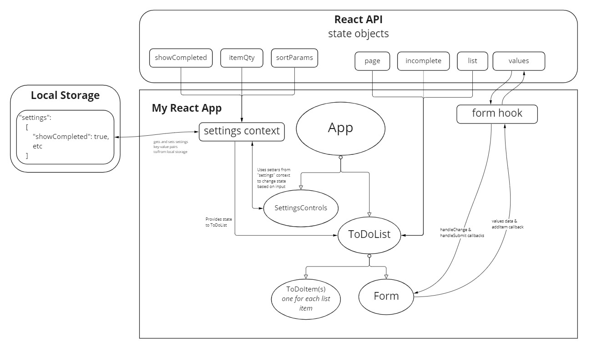
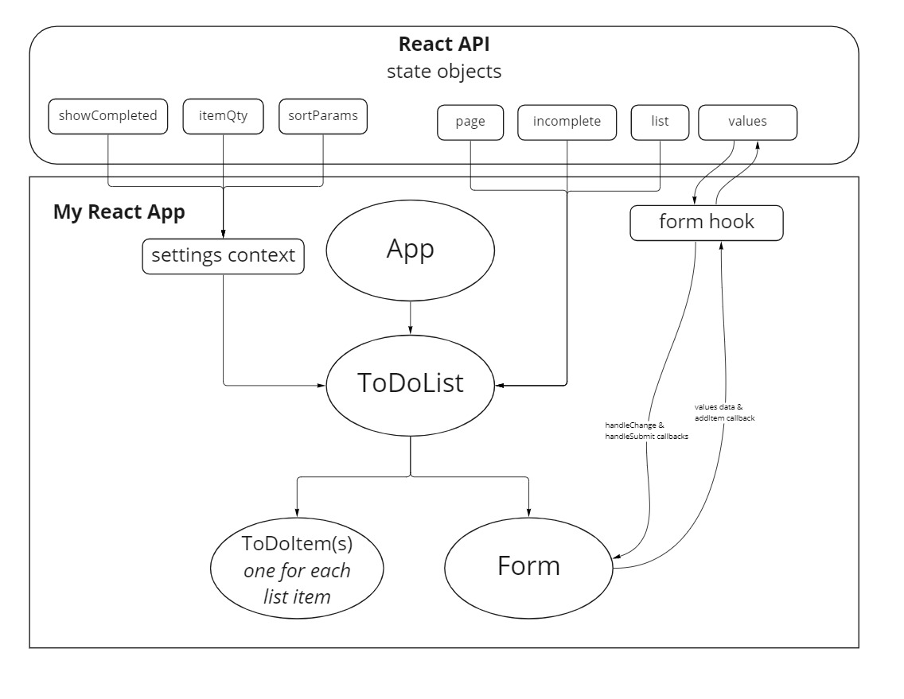

# Todo App

A Web Application for securely managing a To Do List.

## UML

## How is global state being consumed

Global state is being consumed by the `ToDoList` components in order to pull in and use "parameters" for filtering and paginating `ToDoItem`s. In my implementation, I created these "parameters" as state objects: `showComplete`, `itemQty` for the number of page items, and `sortParams` for filtering out based on keyword search.

## The `useForm` hook

The `useForm` hook provides an interface for creating and setting state for the values in a form, so this code does not need to be repeated in any other forms/form types we might create for our app.

## Previous Version UMLs

### Lab 31 UML

